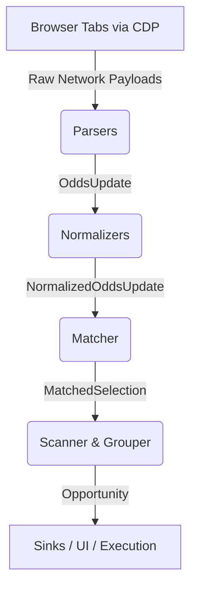

# Sportsbook Arbitrage Finder - Developer Guide

This document provides a comprehensive overview of the Sportsbook Arbitrage Finder architecture. It is designed to help engineers understand the data flow, the core components, and how to build on top of or extend the existing system.

## 1. System Overview

The Sportsbook Arbitrage Finder is a real-time, low-latency pipeline that ingests live sports odds from multiple sportsbooks, normalizes the data into a canonical format, matches equivalent markets across different books, and scans for mathematical arbitrage opportunities.

Unlike traditional scraping bots that rely on raw HTTP polling (which are quickly blocked by anti-bot systems like Datadome or Cloudflare), this system uses a **Chrome DevTools Protocol (CDP)** ingestion layer. It attaches to active, authenticated browser tabs and silently intercepts the underlying WebSocket frames and background XHR/Fetch requests.

### Supported Sportsbooks
- DraftKings
- FanDuel
- BetMGM
- Caesars
- Betano

---

## 2. Architecture & Data Flow

The pipeline operates in a continuous, asynchronous event loop. Data flows through several distinct layers:

### Layer 1: Ingestion (CDP Clients)
- **Mechanism**: The system connects to running Chrome instances via the CDP debugging port (e.g., `localhost:19222`).
- **Functionality**: It intercepts network traffic natively. If a sportsbook uses WebSockets (e.g., BetMGM, DraftKings), it intercepts the frames. If they use Server-Sent Events or long-polling (e.g., FanDuel), it intercepts the HTTP response bodies.
- **Benefits**: Perfect emulation. The sportsbooks see a completely legitimate browser footprint.

### Layer 2: Parsers (`src/arbfinder/parsers/`)
- **Responsibility**: Convert raw JSON payloads or custom websocket protocols into raw `OddsUpdate` objects.
- **Statefulness**: Many parsers are stateful. They must process the initial full-state HTTP payload (which contains dictionaries mapping internal UUIDs to team names) before they can decode subsequent minimal WebSocket ticks.
- **Extensibility**: To add a new book, you subclass `BookParser` and implement `handle_http_body()` and `handle_ws_frame()`.

### Layer 3: Normalizers (`src/arbfinder/normalization/`)
- **Responsibility**: Standardize team names, market types, and line values.
- **Functionality**: "OAK Athletics" (Caesars) and "Oakland Athletics" (DraftKings) must resolve to the same canonical entity. Normalizers also standardize market types into canonical strings: `moneyline`, `run_line`, `total`, `spread`, etc.
- **Output**: `NormalizedOddsUpdate` objects.

### Layer 4: Matcher (`src/arbfinder/matching/`)
- **Components**: `BucketStore`, `TimeResolver`, and `Matcher`.
- **Responsibility**: Group related normalized updates into logical buckets based on the specific game/event.

### Layer 5: Scanner (`src/arbfinder/scanner/`)
- **Components**: 
  - `MarketGrouper`: Groups updates by `MarketGroupKey` (Game + Market Type + Line). E.g., "Phillies vs Angels | run_line | -1.5".
  - `StalenessFilter`: **Crucial component**. Drops any individual sportsbook's odds if their `captured_at` timestamp is older than a configurable threshold (e.g., 60 seconds). This prevents "ghost arbs" caused by disconnected feeds.
  - `DedupTracker`: Prevents spamming the sinks with identical, continuous arbitrage events.
  - `Scanner`: Calculates the implied probabilities and margin. If the total implied probability is `< 1.0`, an `Opportunity` is emitted.

### Layer 6: Sinks & Orchestration
- **Sinks**: Opportunities are pushed to various sinks (`ConsoleSink`, `FileSink`, `WebSocketSink`).
- **Orchestration**: A top-level asyncio `orchestrator.py` manages the initialization of the CDP clients, the health/liveness of each sportsbook feed (`HealthTracker`), and graceful shutdown procedures.

---

## 3. Key Concepts & Edge Cases

### Hanging Odds (Ghost Arbs)
During live events (e.g., a home run is hit), one sportsbook (e.g., BetMGM) might instantly update their odds via WebSocket, while another (e.g., DraftKings) might experience a slight delay or intentionally suspend their API without sending a "suspend" frame immediately. 
Our system will mathematically detect this as a massive arbitrage opportunity. However, attempting to execute the lagging side of the arb will likely result in a betslip rejection. The `StalenessFilter` caps the lifespan of these ghost arbs (default 60s), but engineers should be aware that high-margin (15%+) live arbs are often un-executable due to bookmaker latency.

### American Odds Math
The scanner natively processes decimal odds for mathematical simplicity. To convert from American odds (e.g., +150, -200) to implied probability:
- Positive (+150): `100 / (150 + 100) = 40%`
- Negative (-200): `200 / (200 + 100) = 66.6%`
Arbitrage exists when `Sum(Implied Probabilities) < 1.0`.

---

## 4. Testing & Replay System

The project includes a robust, deterministic replay system (`tests/test_scanner/test_replay.py`).
- **Timeline Logs**: Network intercepts are saved as JSON and TXT files alongside a `timeline.jsonl` manifest containing exact timestamps.
- **Simulation**: The replay script injects these payloads into the parsers in chronological order, overriding the `captured_at` timestamps to perfectly simulate a live environment.
- **Usage**: When debugging parser logic, normalizer mappings, or scanner behavior, *always* use the replay system to ensure reproducible results.

---

## 5. Adding a New Sportsbook

To integrate a new sportsbook, follow these steps:
1. **Analyze Network Traffic**: Open the sportsbook in Chrome DevTools. Identify the initial state JSON endpoint and the WebSocket/SSE endpoint used for live ticks.
2. **Build Parser**: Create `src/arbfinder/parsers/newbook.py`. Implement state management to map IDs to team names if necessary.
3. **Build Normalizer**: Create `src/arbfinder/normalization/book_normalizers/newbook_normalizer.py`. Map their proprietary team abbreviations to your canonical strings.
4. **Update Config**: Add the new book to `config/settings.yaml` to ensure the orchestrator instantiates the CDP pipeline for it.
